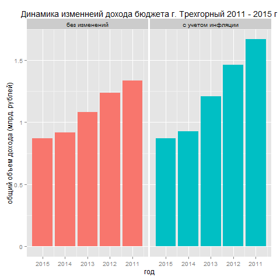
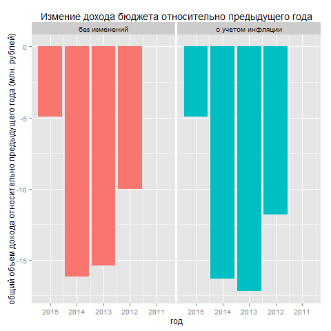
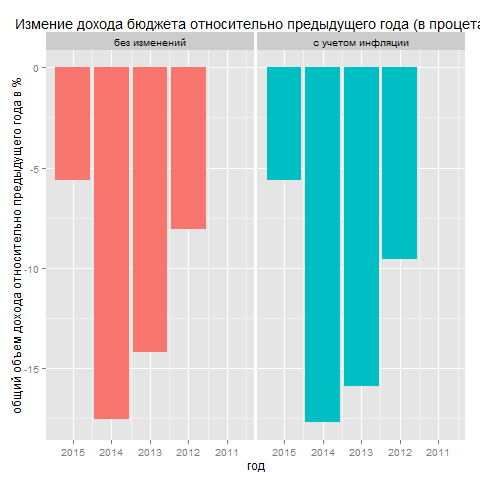
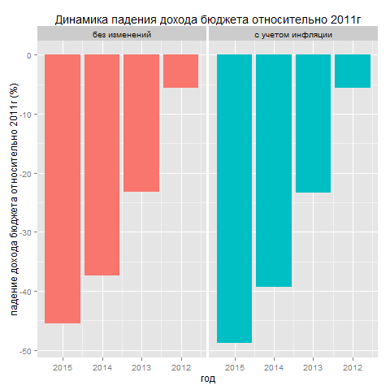

```{r, echo=FALSE}
#Sys.setlocale(category="LC_CTYPE", locale = "russian")
```

---
title: "Бюджет г. Трехгорный. Динамика изменений. 2011-2015г."
author: "max.putilov@gmail.com"
date: "Saturday, April 18, 2015"
output: html_document
---


##Исходные данные.
###Бюджет

[2013, 2014, 2015](http://admintrg.ru/city/budget.php) года. 
[2012](http://admintrg.ru/city/budget_2012.php) год.
[2011](http://admintrg.ru/city/budget_2011.php) год.

[табличный формат](https://docs.google.com/spreadsheets/d/1I8uIIRErRdgT-JmSbRNK66w1y-y2P5PahTEUQBPYqag/edit?usp=sharing)

[csv формат](https://raw.githubusercontent.com/baio/trg-budget/master/data/trg_budget.csv)

###Инфляция

[исходный документ](https://www.statbureau.org/ru/russia/inflation-tables)

[табличный формат](https://docs.google.com/spreadsheets/d/1I8uIIRErRdgT-JmSbRNK66w1y-y2P5PahTEUQBPYqag/edit#gid=1417059804)

[csv формат](https://raw.githubusercontent.com/baio/trg-budget/master/data/inf-2015-2001.csv)

###Исходный код документа

[github](https://github.com/baio/trg-budget)

##Исходные данные, замечание

Данные в публичном доступе доступны за период от 2011 по 2015 год. Данные за 2013, 2014, 2015 были определены в документе конца 2012 года, так как каждый год бюджет пересматривается данные за 2014 и 2015 год скорее всего не точные.

##Описание документа.

Отслеживание динамики основных показателей бюджнта города Трехгорного (Челябинская обл. Россия), за период 2011-2015 год.

Рассматриваются следующие основные показатели:

+ общий объем доходов бюджета [1]
+ в том числе объем межбюджетных трансфертов, получаемых из других бюджетов бюджетной системы Российской Федерации [2]
+ общий объем расходов бюджета [3]
+ дефицит бюджета [4]
+ Данные значения так же индексируются по значения инфляции, по следующему алгоритму:

##Расчет инфляции

Исходный год 2015, устанавливается как базовый со значением инфляции 0.

Значения следующего года умножаются на значение среднемесячной инфляции этого года, например индексирумеое значение за 2014 год получается следующим образом `value * (1 + (процнент среднемесячной инфляции 2014 года) / 100)`

Значение инфляции следующего года рачитывается как кумулативная сумма инфляции предыдущих лет плюс среднемесячная инфляция за текущий год, например индексирумеое значение за 2012 год получается следующим образом `value * (1 + (инфляция за 2014 + инфляция за 2013 + процнент среднемесячной инфляции за 2012 год) / 100)`


```{r, echo=FALSE}

##Load and format source data source
source("read-and-clean.r")

#Plots
#source("plot-gain.r")
#source("plot-gain-relative.r")
#source("plot-gain-percent.r")
#source("plot-gain-percent-cumul.r")

```

## Динамика изменения общего дохода бюджета 



Доход бджета (100 тыс)

``` {r, echo=F} 

budget[, c(2, 3)]

```

## Динамика изменения дохода бюджета относительно предыдущего года



Динамика изменения бюджета относительно предыдущего года (100 тыс)

``` {r, echo=F} 

budget[, c(2, 7)]

```

## Динамика изменения дохода бюджета относительно предыдущего года в процентах



Динамика изменения бюджета относительно предыдущего года (%)

``` {r, echo=F} 

budget[, c(2, 15)]

```


## Суммарное изменение дохода бюджета относительно 2011 года в процентах



Суммарное изменение дохода бюджета относительно 2011 года в процентах

``` {r, echo=F} 

budget[, c(2, 15)]

```
